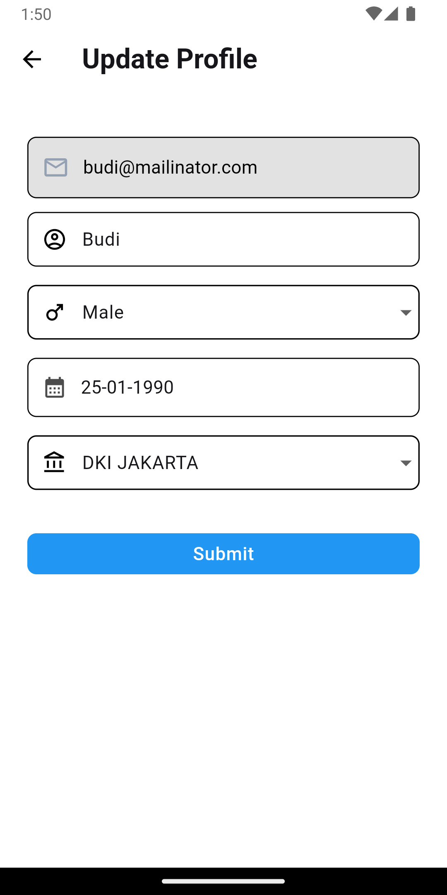

# task_management_app

## Getting Started

Task Management app is an application built with the Flutter framework. This app implements the clean architecture concept and follows the Domain-Driven Design (DDD) folder structure. It also utilizes the Bloc state management approach & dependency injection (DI). The app can run in offline mode and supports task data synchronization when the internet connection is available. Additionally, unit tests are implemented to validate the login form and task submission functionality, ensuring reliability and correctness of the app's core features.

### Requirement:
* Flutter Version: 3.22.3

### Installation:
* Clone this project..
* Run the following commands in the terminal to launch the application:
 1. "flutter pub get"
 2. "flutter run"

### Features:
* Sign In

* Register

* Task List

* Add, edit, delete Task

* Search task by title

* Filter task by status

* Offline Mode & Sync data

* Light Mode & Dark Mode Theme

* Edit Profile

* Form Validation 

* Error Handle
 -App Error
 -Network Error

### Packages & Libraries:
* flutter_bloc: Used for state management using the Bloc pattern.

* cloud_firestore: Used to interact with Firebase Firestore Database.

* connectivity_plus: Used to detect internet connectivity.

* dio: Used to make HTTP requests.

* dartz: Used for functional programming.

* freezed: Used for generated code and immutable values.

* firebase_auth: Used for authentication with Firebase Auth.

* firebase_core: Used for Firebase configuration.

* flutter_secure_storage: Used to store data securely.

* get_it: Used for dependency injection.

* go_router: Used for routing in the app.

* hive: Used for local data persistence.

* injectable: Used for dependency injection.

* intl: Used for internationalization and localization.

* pull_to_refresh: Used for pull-to-refresh functionality.

* shimmer: Used for shimmer loading effect.

* uuid: Used to generate UUIDs in Flutter.

* mockito: Used for mocking objects in tests.

* flutter_local_notifications: Used to display local notifications in the app.

               
 
  
